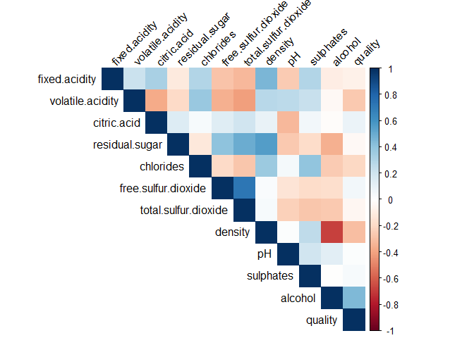
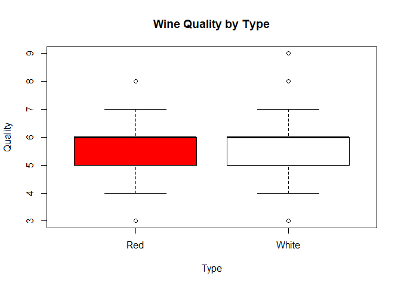
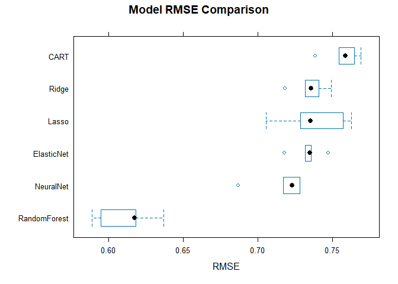
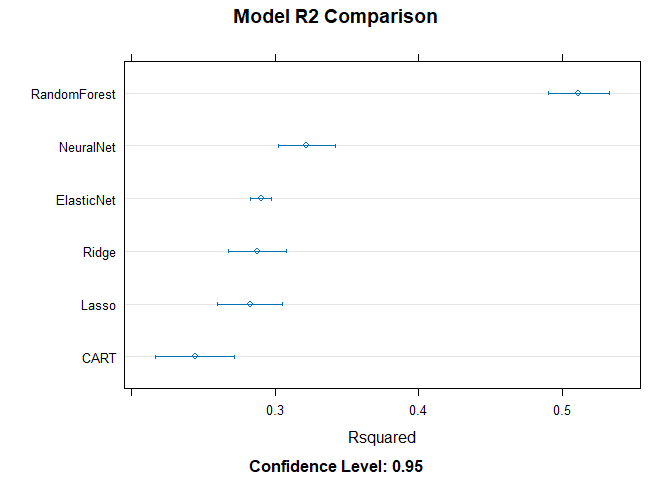

Wine Quality Prediction
================
Angela Herrera

# Introduction

This analysis explores whether wine chemical composition can predict
quality ratings.  
Using red and white *Vinho Verde* datasets, we train and compare several
models.

``` r
# Load libraries
library(caret)
library(ggplot2)
library(corrplot)
library(GGally)
library(glmnet)
library(randomForest)
library(nnet)
library(rpart)
```

# 1. Data Loading

``` r
red <- read.csv("../data/winequality-red.csv", sep = ";")
white <- read.csv("../data/winequality-white.csv", sep = ";")

red$Type <- "Red"
white$Type <- "White"

wine_data <- rbind(red, white)
wine_data$Type <- as.factor(wine_data$Type)

summary(wine_data)
```

    ##  fixed.acidity    volatile.acidity  citric.acid     residual.sugar  
    ##  Min.   : 3.800   Min.   :0.0800   Min.   :0.0000   Min.   : 0.600  
    ##  1st Qu.: 6.400   1st Qu.:0.2300   1st Qu.:0.2500   1st Qu.: 1.800  
    ##  Median : 7.000   Median :0.2900   Median :0.3100   Median : 3.000  
    ##  Mean   : 7.215   Mean   :0.3397   Mean   :0.3186   Mean   : 5.443  
    ##  3rd Qu.: 7.700   3rd Qu.:0.4000   3rd Qu.:0.3900   3rd Qu.: 8.100  
    ##  Max.   :15.900   Max.   :1.5800   Max.   :1.6600   Max.   :65.800  
    ##    chlorides       free.sulfur.dioxide total.sulfur.dioxide    density      
    ##  Min.   :0.00900   Min.   :  1.00      Min.   :  6.0        Min.   :0.9871  
    ##  1st Qu.:0.03800   1st Qu.: 17.00      1st Qu.: 77.0        1st Qu.:0.9923  
    ##  Median :0.04700   Median : 29.00      Median :118.0        Median :0.9949  
    ##  Mean   :0.05603   Mean   : 30.53      Mean   :115.7        Mean   :0.9947  
    ##  3rd Qu.:0.06500   3rd Qu.: 41.00      3rd Qu.:156.0        3rd Qu.:0.9970  
    ##  Max.   :0.61100   Max.   :289.00      Max.   :440.0        Max.   :1.0390  
    ##        pH          sulphates         alcohol         quality         Type     
    ##  Min.   :2.720   Min.   :0.2200   Min.   : 8.00   Min.   :3.000   Red  :1599  
    ##  1st Qu.:3.110   1st Qu.:0.4300   1st Qu.: 9.50   1st Qu.:5.000   White:4898  
    ##  Median :3.210   Median :0.5100   Median :10.30   Median :6.000               
    ##  Mean   :3.219   Mean   :0.5313   Mean   :10.49   Mean   :5.818               
    ##  3rd Qu.:3.320   3rd Qu.:0.6000   3rd Qu.:11.30   3rd Qu.:6.000               
    ##  Max.   :4.010   Max.   :2.0000   Max.   :14.90   Max.   :9.000

# 2. Exploratory Data Analysis

``` r
numeric_vars <- wine_data[, sapply(wine_data, is.numeric)]
corr_matrix <- cor(numeric_vars)
corrplot(corr_matrix, method = "color", type = "upper", tl.col = "black", tl.srt = 45)
```

<!-- -->

``` r
boxplot(wine_data$quality ~ wine_data$Type,
        main = "Wine Quality by Type",
        xlab = "Type", ylab = "Quality", col = c("red", "white"))
```

<!-- -->

# 3. Train-Test Split

``` r
set.seed(123)
train_index <- createDataPartition(wine_data$quality, p = 0.8, list = FALSE)
train <- wine_data[train_index, ]
test  <- wine_data[-train_index, ]
ctrl <- trainControl(method = "cv", number = 5)
```

# 4. Model Training

``` r
# Ridge Regression
ridge <- train(quality ~ ., data = train, method = "glmnet",
               trControl = ctrl,
               tuneGrid = expand.grid(alpha = 0, lambda = seq(0.01, 0.1, 0.01)))

# Lasso Regression
lasso <- train(quality ~ ., data = train, method = "glmnet",
               trControl = ctrl,
               tuneGrid = expand.grid(alpha = 1, lambda = seq(0.01, 0.1, 0.01)))

# Elastic Net
elastic <- train(quality ~ ., data = train, method = "glmnet", trControl = ctrl, tuneLength = 5)

# CART
cart <- train(quality ~ ., data = train, method = "rpart", trControl = ctrl, tuneLength = 5)

# Random Forest
rf <- train(quality ~ ., data = train, method = "rf", trControl = ctrl, tuneLength = 3)

# Neural Network
nn <- train(quality ~ ., data = train, method = "nnet", trControl = ctrl,
            linout = TRUE, trace = FALSE, tuneLength = 5)
```

# 5. Model Evaluation

``` r
results <- list(
  Ridge = postResample(predict(ridge, test), test$quality),
  Lasso = postResample(predict(lasso, test), test$quality),
  ElasticNet = postResample(predict(elastic, test), test$quality),
  CART = postResample(predict(cart, test), test$quality),
  RandomForest = postResample(predict(rf, test), test$quality),
  NeuralNet = postResample(predict(nn, test), test$quality)
)

results_df <- data.frame(
  Model = names(results),
  RMSE = sapply(results, "[[", "RMSE"),
  Rsquared = sapply(results, "[[", "Rsquared"),
  MAE = sapply(results, "[[", "MAE")
)

results_df
```

    ##                     Model      RMSE  Rsquared       MAE
    ## Ridge               Ridge 0.7384481 0.3055930 0.5743975
    ## Lasso               Lasso 0.7406368 0.3016196 0.5764688
    ## ElasticNet     ElasticNet 0.7383748 0.3033346 0.5737593
    ## CART                 CART 0.7733898 0.2349339 0.5984110
    ## RandomForest RandomForest 0.6089136 0.5337134 0.4384772
    ## NeuralNet       NeuralNet 0.7100615 0.3558762 0.5572114

# 6. Model Comparison

``` r
model_list <- list(Ridge=ridge, Lasso=lasso, ElasticNet=elastic,
                   CART=cart, RandomForest=rf, NeuralNet=nn)
resamp <- resamples(model_list)

bwplot(resamp, metric = "RMSE", main = "Model RMSE Comparison")
```

<!-- -->

``` r
dotplot(resamp, metric = "Rsquared", main = "Model R2 Comparison")
```

<!-- -->

# Conclusion

The Random Forest model achieved the best predictive accuracy, with an
RMSE of ~0.61 and R2 of ~0.54. This suggests that wine quality can be
moderately predicted using chemical composition data. Future work could
involve testing deep learning or separate models for red and white
wines.
